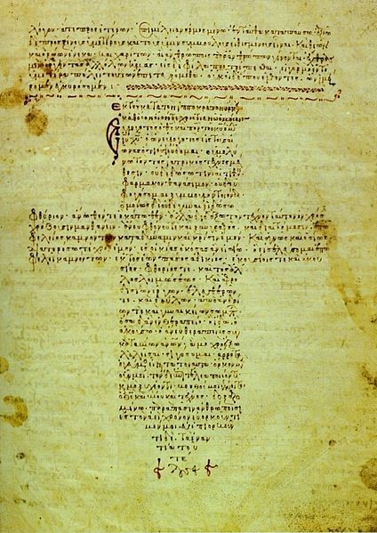

# medicine #

原作者：李喜鹊（李坦）

----------

**公元前400年:**

Hippocrates,使用曼德拉草根（mandrake root）治疗躁狂症患者。安神醒脑成分：argentum 	nitricum硝酸银、cocculus木防己，ignatia吕宋豆等等

----------

**公元前168年**

为了对比，我们来简单看一眼中医，《黃帝内经》算最早的吧，根据1973年在马王堆3号墓所出土文物，完备的《黃帝內經》的成书年代要晚于公元前168年。 我们中医草药的最重要最“详尽”最权威的著作是《本草纲目》，明代李时珍所著，成书于1590年，绘有插图1160幅：

----------

下面我们来看看古代外国的医药学著作，我们来把古代中西医对比一下，比比文献，比比医学理论，比比内科外科，比比博大精深，比比历史悠久，比比哪国的神医牛 逼。【看下文之前，我建议各位老中医们请自备速效救心丸，虽然我本人推荐的是：硝酸甘油+心脏复苏术；ECG运动试验+同位素心肌灌注显影 + CT/Calcium scoring；然后造影+搭桥；最后别忘了每日50mg水溶阿司匹林哦亲，治好心梗之后可以算是中药的疗效哦亲。】

 本文并不局限于论述“西医”（古希腊医学），还包括其他地区的医学，如阿拉伯印度医学

史实说话，下图是最著名最古老的医学文献，古埃及埃德文·史密斯外科手术指南（Edwin Smith papyrus），大约抄写于公元前17世纪，而原版是写于公元前3000－2500年间，作者的名字不详，但作者的职业地位被认为是一名博学家、僧侣、医生。

这本外科手术指南详细论述了48个病例，可以被认为是一部经典的医学专著，从头部到躯干依次讨论了各个部位的创伤。它先描写病人的病情，再下诊断，然后描论 述病理，最后写出治疗方法。在书中，它详细描绘了人体局部解剖、骨折、感染、止血、制动术、脊椎伤、脑外伤、脑膜脑脊液、脉动等等。 它的描写相当 理性（a rational and scientific approach），没有用巫术与玄幻来解释疾病。中医经过了多少个世纪才达到这种水平？

除此之外，还有许多写在草纸上的其他医学著作，例如：

公元前 1800 年的Kahun Gynaecological Papyrus记录了妇科疾病、生育、怀孕、避孕措施；

公元前1600的 the Hearst papyrus 论述了泌尿系统、血液、毛发、叮咬伤、头疼、肠胃不适与肺病的治疗；

公元前1550年的Ebers papyrus论述了皮肤病学、肠道疾病、创伤、牙科疾病、妇科疾病；

公元前2000年的arlsberg papyrus，论述了眼科疾病的治疗和对怀孕的描写；

公元前1980年的Ramesseum Papyrus （包括了17 独立的章节部分） 着重描述了眼科疾病、妇科、儿科、肌肉、肌腱；

公元前1300年的 the Brugsch Papyrus论述了避孕和怀孕检测；

公元前1200 年的 Chester Beatty Medical Papyrus主要论述了头痛和直肠疾病；

公元前1300年的 the London Medical Papyrus论述了蛇、蝎、蜘蛛中毒叮咬的治疗。

下面两幅图就是Ebers Papyrus中的两页（它一共110篇20米长）。描写了对哮喘的治疗：在烧热的砖块上烧制草药，患病者吸入草药的烟气：

这是对癌症肿瘤的描述：“recounting a tumor against the god Xenus, it recommends do thou nothing there against（这算是姑息疗法？）”：

实话实说，这些医学著作的内容并不完全与Edwin Smith papyrus外科手术指南一样“理性、科学”，和后来的中医一样，里面也包含了大量的巫术和玄学，但这在当时是有史料记载的最先进最系统的医学技术。

下图，是公元前300多年前 在Temple of Kom Ombo的碑刻，刻画了古埃及的外科手术器材：

下图中，是被古埃及截肢者的假肢，用木头和皮革制成：

现存最早的草药绘图绘于公元前500年左右的埃及，是一部从古希腊流传过来的药典的插图，残片画的是一株聚合草，画在纸莎草纸上，还是彩色的，下面写的是古希腊语。J. da M. Johnson于1904年在埃及考古发现，存于伦敦Wellcome图书馆：

在公元前1500年左右，出现了印度传统医学Ayurveda，它与其宗教文化结合，理念元素是各种元素的平衡。

公元1000多年前，有记载印度“神医”Susrutha做外科手术，且成功率高，尤其是整形手术，与此同时，印度人研究了麻醉技术：

我承认，这幅图太坑爹了。。。。

在 地中海沿岸和美索不达米亚，公元前2000年—1600BC，巴比伦人著作了诊断手册（Diagnostic Handbook）。著作中对诊断、预后、体检和处方作出了定义，并出现了“理性与经验主义相结合”的治疗思路，且非常强调“疾病预防、卫生、保健与“养 生之道”的重要性：

The commands concern prophylaxis and suppression of epidemics, suppression of venereal disease and prostitution, care of the skin, baths, food, housing and clothing, regulation of labor, sexual life, discipline of the people,  etc. Many of these commands, such as Sabbath rest, circumcision, laws concerning food (interdiction of blood and pork), measures concerning menstruating and lying-in women and those suffering from gonorrhea, isolation of lepers, and hygiene of the camp, are, in view of the conditions of the climate, surprisingly rational." (Neuburger: History of Medicine, Oxford University Press, 1910, Vol. I, p. 38).

在大约公元700年前的古希腊与罗马时期，出现了第一所医学院（Cnidus），在里面任职的Alcmaeon著作了第一部系统的人体解剖学著作。自此同时，希腊发展出了追求“体液平衡”的医学思想。

之后，在公元前460—377年， 现代医学之父，希波克拉底，著成了Hippocratic Corpus，他的Hippocratic Oath，医务道德誓词, 在一九四八年改写为《世界医学会日内瓦宣言》：

　 　 “我以阿波罗及诸神的名义宣誓：我要恪守誓约，矢忠不渝。对传授我医术的老师，我要像父母一样敬重。对我的儿子、老师的儿子以及我的门徒，我要悉心传授医 学知 识。我要竭尽全力，采取我认为有利于病人的医疗措施，不给病人带来痛苦与危害。我不把毒药给任何人，也决不授意别人使用它。我要清清白白地行医和生活。无 论进入谁家，只是为了治病，不为所欲为，不接受贿赂，不勾引异性。对看到或听到不应外传的私生活，我决不泄露。如果我违反了上述誓言，请神给我以相应的处 罚。”

　 　At the time of being admitted as a member of the medical profession ,I solemnly pledge myself to consecrate my life to the service of humanity: I will give to my teachers the respect and gratitude which is their due; 　　I will practice my profession with conscience and dignity; The health and life of my patient will be my first consideration; I will respect the secrets which are confided in me; I will maintain by all means in my power, the honor and the noble traditions of the medical profession; My colleagues will be my brothers: I will not permit considerations of religion, nationality, race, party politics or social standing to intervene between my duty and my patient; I will maintain the utmost respect for human life, from the time of its conception, even under threat, I will not use my medical knowledge contrary to the laws of humanity; I make these promises solemnly, freely and upon my honor... ---------Declaration of Geneva, 　The Second General Assembly of the World Medical Association, 1948。

回 到中东地区，随着古希腊与印度医学的流入，穆斯林世界的医学得以再次蓬勃发展。其中，第一代波斯人的医生在Academy of Jundishapur医学院接受系统的医学理论教育。后来这所医学院演变成了中世纪穆斯林的Bimaristan医院。穆斯林文化对医药科学作出了重要 贡献，它建立了系统的解剖学、生理学、眼科学、药理学、药剂学、外科学和 制药业科学。医学家Al-Kindi，首次把数学引入医学，特别是在药剂领域，发展出了用数学计量法测定药剂的强度与浓度的方法。注意，穆斯林在医药领域 运用的“数学”是统计、测量、代数公式等等，不是光扒拉扒拉算盘，那是店小二结帐。

同期中世纪，穆斯林的医学著作无数。Abu al-Qasim（公元1000年） 写了30卷的医学百科全书《Kitab al-Tasrif》；

Avicenna在1025年著作了《The Canon of Medicine》(医学规范) ，在1027年完成了《 The Book of Healing》(康复丛书) 。著作论述了临床试验、实验医学、传染病预防等等；

在 1242年， Ibn al-Nafis首先描写了心肺血液循环与新陈代谢；

在1390年，Mansur ibn Ilya的著作The Tashrih al-badan（人体解剖学）中，出现了大量人体血管神经解剖图。

等等等等等等等等等等等等。。。。。。。。。。。。。。

下图，是阿拉伯手抄本的《眼解剖》，写于1200 年，作者是 al-Mutadibih。如果你看过眼睛的现代解剖图，你就会觉得这实在是太牛逼了，居然连神经都画的那么详细：

当然，要承认，西方的这个更好...1604年再版的Kepler's Paralipomena ad Vitellionem 。Figures from Felix Platter showing the anatomy of the eye, reprinted in Kepler's Paralipomena ad Vitellionem (1604)

阿拉伯的草药书：

文艺复兴后的欧洲医学。。。。。。我太累了，你们自己查吧....

下面直接上一些古代西方的草药学 医学书籍的图谱：

现存最古老的草药药典完整抄本是公元512年（中国南北朝）时期，拜占庭公主抄写的希腊《药物学》（一世纪的著作）的手抄本，历经1500年。记录了 4,740药物和 360种药用:

后来的，其他的，更详尽的，很多很多的。。。意大利的Circa instans ，School of Salerno, 写于1190年：

Garden of Health百科全书，802 个章节，1491年：

"Wdissz Seeblum” , 1532年，植物学药材著作：

医学植物学家 Leonhart Fuchs监制的Turcicum frumentum：

实用草药学Herbs in the practice of medicine，出版于1577年：

同时代的西方解剖学谱图：

De Humana Physiognomia, 写于1586：

下面这是两张人体解剖图。上一张出自1774年威廉姆·亨特的《孕妇子宫》；下一张是出自1830年王清任的《医林改错》：

再发一张同时代的对比图。左边是明代高武撰的《针灸聚英》中的“五脏六腑之图”刊于1529年；右边是人体解剖之父维萨里Andreas Vesaliua在1543年出版的《人体结构（De humani corporis fabrica）》：

让我们在复习一遍：

